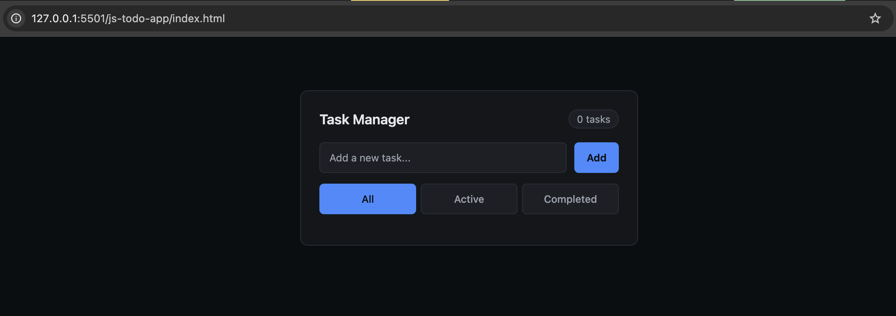
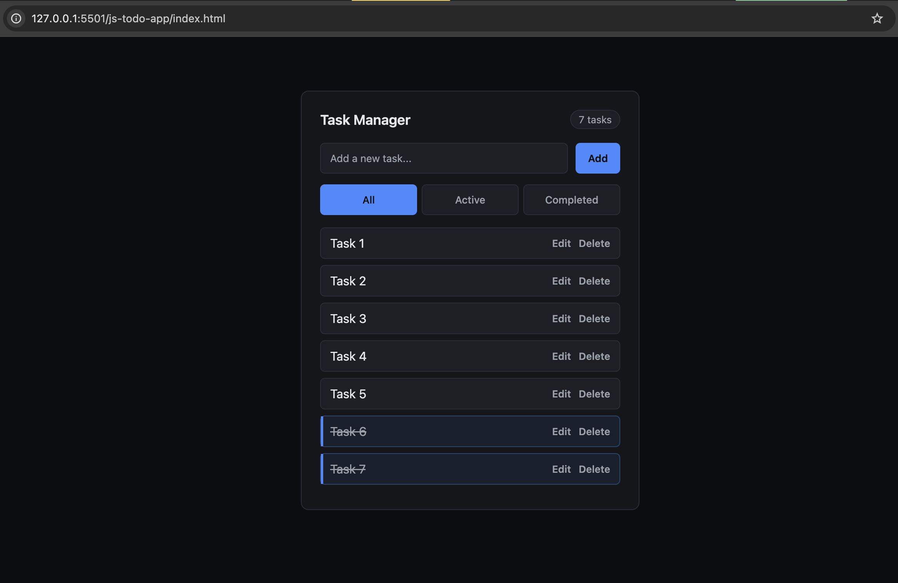
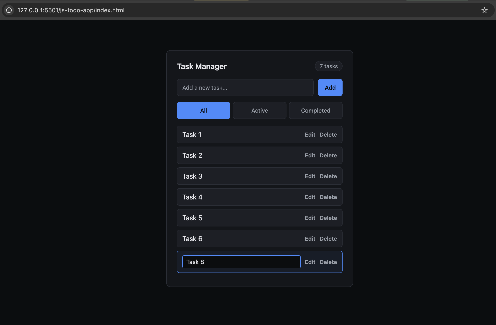
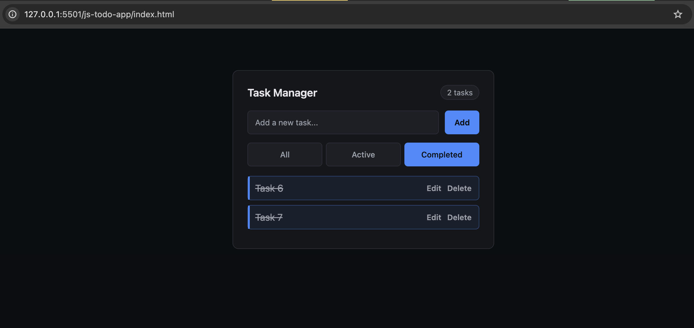
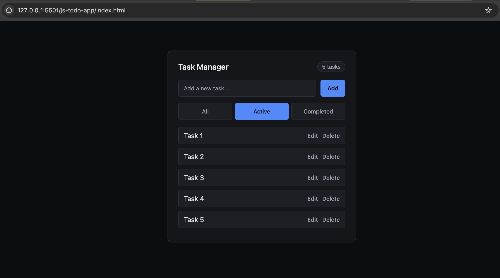

# Task Manager (Vanilla JavaScript)

A clean, minimal, and state-driven Task Manager application
built using vanilla JavaScript with a professional dark UI.

## Features
- Add, edit, delete tasks
- Mark tasks as completed
- Filter tasks (All / Active / Completed)
- Persistent data using localStorage
- Keyboard support (Enter to add task)
- Clean and readable UI

## Screenshots

### Empty State

### All Tasks View

### Inline Editing

### Completed Tasks Highlight

### Active Tasks Filter

## Tech Stack
- HTML
- CSS
- JavaScript (Vanilla)

## Key Concepts Used
- DOM manipulation
- Event handling
- State-driven rendering
- Array methods (map, filter)
- localStorage persistence

## Why this project?
This project focuses on logic, structure, and clarity rather than flashy UI.
It demonstrates how real-world applications manage state and UI updates.

## How to run
Simply open `index.html` in your browser.
